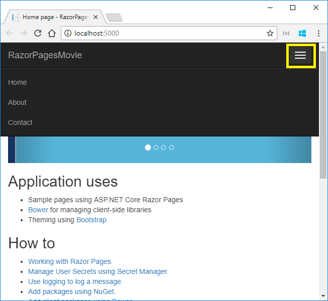

# Getting started with Razor Pages in ASP.NET Core with Visual Studio for Mac

By [Rick Anderson](https://twitter.com/RickAndMSFT)

This tutorial will teach you the basics of building an ASP.NET Core Razor Pages web app. We recommend you complete [Introduction to Razor Pages](xref:mvc/razor-pages/index) before starting this tutorial. Razor Pages is the recommended way to build UI for web applications in ASP.NET Core.

## Prerequisites

Install the following:

* [.NET Core 2.0.0 SDK](https://dot.net/core) or later.
* [Visual Studio for Mac](https://www.visualstudio.com/vs/visual-studio-mac/) 

## Create a Razor web app

From a terminal, run the following commands:

```console
dotnet new razor -o RazorPagesMovie
cd RazorPagesMovie
dotnet run
```

The preceding commands use [dotnet](https://docs.microsoft.com/dotnet/core/tools/dotnet) to create and run a Razor Pages project.


The default template creates **RazorPagesMovie**, **Home**, **About** and **Contact** links. Depending on the size of your browser window, you might need to click the navigation icon to show the links.



## Project files and folders

The following table lists the files and folders in the project. For this tutorial, the *Startup.cs* file is the most important to understand. You don't need to review each link provided below. The links are provided as a reference when you need more information on a file or folder in the project.

| File or folder              | Purpose |
| ----------------- | ------------ | 
| wwwroot | Contains static files. See [Working with static files](xref:fundamentals/static-files). |
| Pages | Folder for [Razor Pages](xref:mvc/razor-pages/index). | 
| *appsettings.json* | [Configuration](xref:fundamentals/configuration) |
| *bower.json* | Client-side package management. See [Bower](xref:client-side/bower).|
| *Program.cs* | [Hosts](xref:fundamentals/hosting) the ASP.NET Core app.|
| *Startup.cs* | Configures services and the request pipeline. See [Startup](xref:fundamentals/startup).|

### The Pages folder

The *_Layout.cshtml* file contains common HTML elements (scripts and stylesheets) and sets the layout for the application. For example, when you click on **RazorPagesMovie**, **Home**, **About** or **Contact**, you see the same elements. The common elements include the navigation menu on the top and the header on the bottom of the window. See [Layout](xref:mvc/views/layout) for more information.

The *_ViewStart.cshtml* sets the Razor Pages `Layout` property to use the *_Layout.cshtml* file. See [Layout](xref:mvc/views/layout) for more information.

The *_ViewImports.cshtml* file contains Razor directives that are imported into each Razor Page. See [Importing Shared Directives](xref:mvc/views/layout#importing-shared-directives) for more information.

The *_ValidationScriptsPartial.cshtml* file provides a reference to [jQuery](https://jquery.com/) validation scripts. When we add `Create` and `Edit` pages later in the tutorial, the *_ValidationScriptsPartial.cshtml* file will be used.

The `About`, `Contact` and `Index` pages are basic pages you can use to start an app. The `Error` page is used to display error information.

>[!div class="step-by-step"]
[Next: Adding a model](xref:tutorials/razor-pages/model)  
